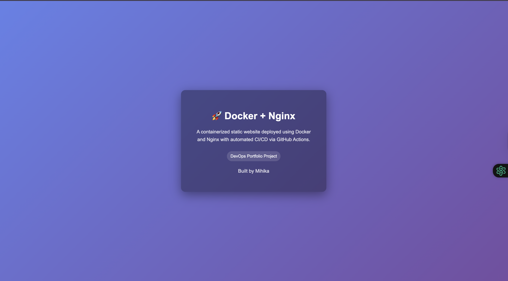

# Portfolio Website 🚀

## Project Overview

This is my **personal portfolio website** hosted on GitHub Pages.  
It showcases my projects, skills, and professional journey in DevOps and web development.  

### Features
- Static website built with HTML & CSS
- Live deployment using **Docker** + **Nginx**
- CI/CD setup with **GitHub Actions**
- Clean, simple, and responsive design
- Navigation between multiple pages (Home, About, Projects)

### Skills & Tools
- **HTML5 & CSS3** – building responsive layouts  
- **Docker** – containerizing the website  
- **Nginx** – serving static files efficiently  
- **Git & GitHub** – version control and CI/CD  
- **GitHub Pages** – hosting static websites  

### Live Demo
Check the website live here: [Portfolio](https://mihika-devops.github.io/devops-ci-cd-static-site/)

### Project Structure
├── index.html # Home page
├── about.html # About Me page
├── projects.html # Projects page (optional)
├── style.css # Styles for website
├── Dockerfile # Docker configuration
└── README.md # Project documentation

## 📸 Preview

